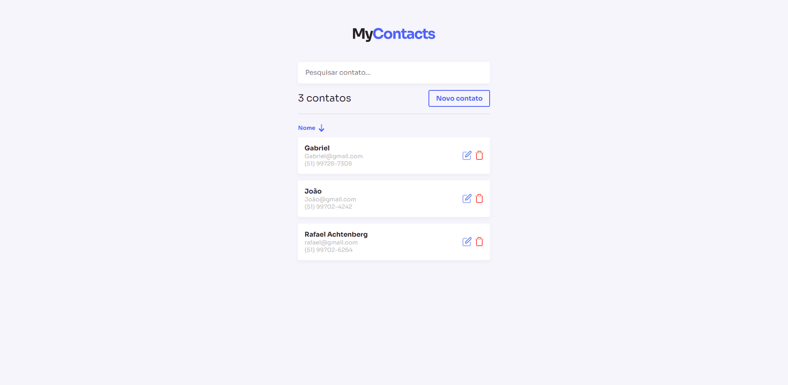

# My Contacts

Este projeto, desenvolvido durante o curso JStack, apresenta uma aplicação de gerenciamento de contatos que utiliza a minha API "mycontacts-api". Com esta aplicação, você pode facilmente salvar, editar, remover, ordenar,categorizar,pesquisar, seus contatos. Tudo isso é proporcionado através de uma interface simples e intuitiva, projetada para facilitar o uso.

## 🛠️ Tecnologias

💻 **Front-end**

- [React](https://react.dev/): Escolhi usar React devido à sua popularidade, flexibilidade,reutilização de componentes e hooks, fazendo assim uma eficiência na construção de interfaces de usuário interativas.
- [Typescript](https://www.typescriptlang.org): Usei Typescript para adicionar tipagem ao código, o que facilita a manutenção, previne erros e melhora a legibilidade.
- [Vite](https://vitejs.dev/): Usei esse bundler pelos beneficios devido à sua rapidez no desenvolvimento e build, proporcionando uma experiência de desenvolvimento mais eficiente.

📚 **Bibliotecas**

- [react-router-dom](https://reactrouter.com/en/main): Utilizado para gerenciar as rotas na aplicação React. Escolhi o react-router-dom devido à sua flexibilidade e facilidade de integração com componentes React. Ele permite criar uma navegação de página única , de forma eficiente, proporcionando uma experiência de usuário suave e dinâmica.

🎨 **Estilização**

- [styled-components](https://styled-components.com/): Usei styled-components para a estilização, pois permite a criação de componentes estilizados de forma mais flexível e dinâmica , alem de claro poder reutilizar facilmente a estilização dos componentes, e separar a estilização do código, assim deixando o código mais limpo e fácil de entender.

🔋 **Versionamento e Deploy**

- [Git](https://git-scm.com) Utilizei Git para controle de versionamento, o que facilita o trabalho colaborativo e o acompanhamento das alterações no código.
- [Vercel](https://vercel.com/) A escolha da Vercel para deploy foi feita devido à sua integração fácil com repositórios Git e sua eficiência no deployment de aplicações front-end.

## Layout Web

## Layout Mobile

 

 

⚙️ **Configuranções e Instalações**

Clone do Projeto

    $ git clone https://github.com/Faelkk/Mycontacts

Instalando as dependências

    $ npm install

Iniciando o projeto

    $ npm run dev

 

**Como me ajudar nesse projeto?**

- Você ira me ajudar muito me seguindo aqui no GitHub
- Dando uma estrela no projeto
- Conectando-se comigo no LinkedIn para fazer parte da minha rede.

 

**Feito por**
[Rafael Achtenberg](linkedin.com/in/rafael-achtenberg-7a4b12284/)
